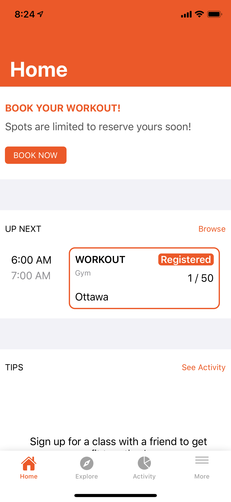
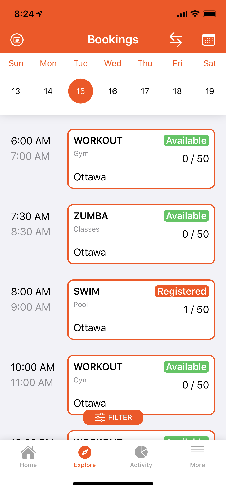
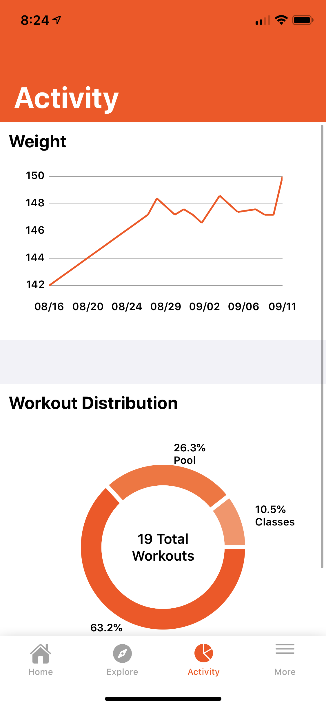
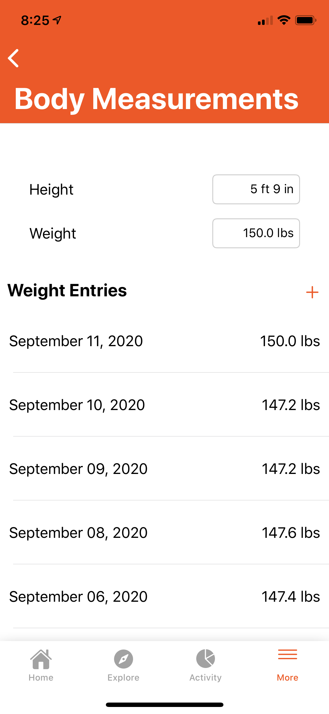

# Workout
An iOS fitness app

Shopify Mobile Developer Intern Challenge (iOS)

Program:	Workout

Author:		Vatsan Prabhu

Date:		15–SEPTEMBER–2020

Purpose:	With the recent pandemic, many businesses have switched to creating/using apps to encourage social distancing. This app would be for a fitness centre/gym to use to provide a platform for members to book their spots in the gym ahead of time, be able to track their weight, view their activity history and distribution, and more.

Run:		Launch XCode project, connect iOS device and build and run onto device

Use:		User will first be put onto the home page. Here the upcoming event and a some tips will show up with data stored if any. 
        On the next tab is the Calendar/Bookings page. Here there will be the events that can be booked and added to your calendar. 
        The next tab is the Activity tab where you can see a chart of your weight progress and also a distribution of your past workouts. 
        On the last tab is the More page where you can enter your personal details for a more personalized experience, enter your weight to be tracked, and enter your personal goals.

Future Improvements:

    Machine learning to recommend activities/workouts based on goals, weight, and history
    Improve UI 
    Use Database to hold events  
    Login functionality
    

Screenshots:

   
